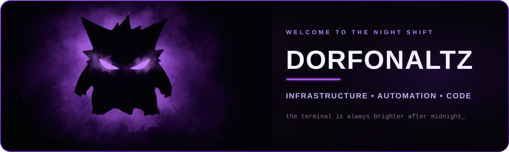

 

  

*Entre infraestrutura, código e algumas coisas que aparecem depois da meia-noite.*

## 🕯️ Sobre mim

Sou **Rodolfo Vonsoski**, profissional de tecnologia em evolução constante, com interesse em **infraestrutura, automação e desenvolvimento**. Gosto de transformar problemas reais em ferramentas simples, funcionais e com personalidade.

- 🔧 Construindo soluções que resolvem problemas do dia a dia
- 🧠 Explorando automação, inteligência artificial e novas tecnologias
- 🏋️ Desenvolvendo o **REPTRIQ**, meu aplicativo de treino e evolução de força
- 👻 Fora do código: filmes de terror, estética sombria e fantasmas roxos

## ⚗️ Arsenal técnico

  

## 🪦 Projetos que sobreviveram à noite

<table>
  <tr>
    <td width="50%" valign="top">
      <h3>🏋️ <a href="https://github.com/Dorfonaltz/reptriq">REPTRIQ</a></h3>
      
Aplicativo de treino e força com ficha personalizada, registro de cargas, PRs, volume, histórico e sincronização entre dispositivos.

      
<code>TypeScript</code> <code>React</code> <code>Drizzle</code> <code>Cloudflare</code>

    </td>
    <td width="50%" valign="top">
      <h3>📊 <a href="https://github.com/Dorfonaltz/meu-livro-de-contas">Livro de Contas</a></h3>
      
Aplicativo web privado para controle financeiro pessoal, despesas por categoria, saldo mensal e planejamento de compras.

      
<code>HTML</code> <code>CSS</code> <code>JavaScript</code> <code>Chart.js</code>

    </td>
  </tr>
</table>

## 🔮 Transmissão atual

<table>
  <tr>
    <td width="50%" valign="top">
      <h3>🟣 Projeto em foco</h3>
      
<strong><a href="https://github.com/Dorfonaltz/reptriq">REPTRIQ</a></strong>

      
Evoluindo a experiência de treino, os registros de carga e a sincronização entre dispositivos.

    </td>
    <td width="50%" valign="top">
      <h3>🌒 Status</h3>
      
<strong>BUILDING AFTER MIDNIGHT</strong>

      
Aprendendo, testando e transformando ideias em projetos que funcionam.

    </td>
  </tr>
</table>

 

<code>THE NIGHT IS DARK — THE TERMINAL IS BRIGHT</code>

  

Perfil em constante construção. Volte depois da meia-noite.

