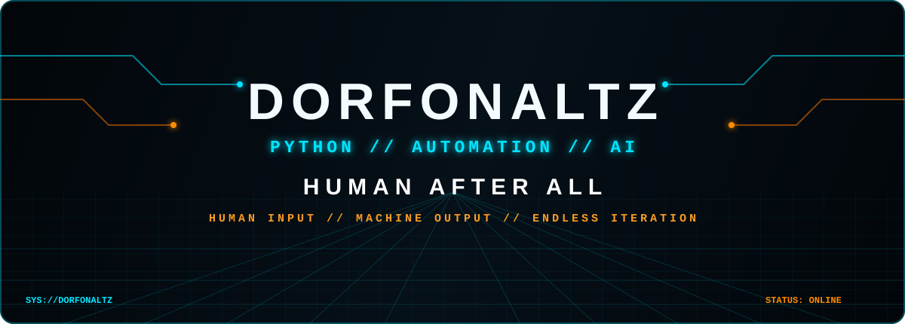
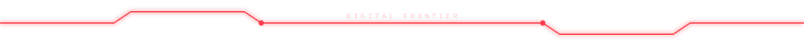

 

01 // IDENTITY

<table>
<tr>
<td width="54%" valign="top">

> whoami

class Dorfonaltz:
    stack = ["Python", "HTML"]
    systems = ["Automation", "AI", "Tools"]
    protocol = "Human After All"

    def mission(self):
        return "Turn ideas into working systems."

</td>
<td width="46%" valign="top">

> system.status

USER ........... Dorfonaltz
CORE ........... Python
INTERFACE ...... HTML
MODULE ......... Automation
CO-PILOT ....... Artificial Intelligence
STATE .......... BUILDING
UPTIME ......... ∞

</td>
</tr>
</table>

Entre humano e máquina, eu prefiro a conexão.Ideia humana. Lógica digital. Execução inteligente.

02 // LOADOUT

  

  

APIs • AI • Automation • Web • Scripts • Tools • Experiments

03 // AI INTERFACE

<table>
<tr>
<td width="33%" align="center">

IDEA

💡Human Input

Conceito, objetivo e criatividade.

</td>
<td width="34%" align="center">

PROCESS

🤖AI Amplification

Pesquisa, código, debug e iteração.

</td>
<td width="33%" align="center">

OUTPUT

⚡Working System

Automação, ferramenta ou projeto real.

</td>
</tr>
</table>

[ HUMAN ] ─────► [ IDEA ] ─────► [ AI / CODE ] ─────► [ SYSTEM ]
     ▲                                                   │
     └────────────────── ITERATE ◄───────────────────────┘

“IA não substitui minhas ideias — ela aumenta o que eu consigo construir.”

04 // TELEMETRY

 

 

05 // PROJECT GRID

<table>
<tr>
<td width="33%" valign="top">

01 // AUTOMATION

SYSTEM: BUILDING

🐍 Python⚙️ Automação🤖 IA

Primeiro módulo em desenvolvimento.

</td>
<td width="34%" valign="top">

02 // AI TOOL

SYSTEM: PLANNED

🧠 Artificial Intelligence🐍 Python🔌 APIs

Experimentos com ferramentas inteligentes.

</td>
<td width="33%" valign="top">

03 // WEB

SYSTEM: PLANNED

🌐 HTML⚡ Interface🧪 Experimentos

Projetos web e interfaces.

</td>
</tr>
</table>

Quando seus próximos repositórios estiverem prontos, esta área pode virar uma central com os projetos reais e links diretos.

06 // CURRENT TRANSMISSION

┌────────────────────────────────────────────────────────────┐
│ DORFONALTZ // DEVELOPMENT CHANNEL                         │
├────────────────────────────────────────────────────────────┤
│ [●] Python ..................................... ACTIVE   │
│ [●] Artificial Intelligence .................... ACTIVE   │
│ [●] Automation ................................. ACTIVE   │
│ [●] HTML / Web ................................. ACTIVE   │
│ [>] APIs ....................................... LOADING  │
│ [>] New technologies ........................... LOADING  │
└────────────────────────────────────────────────────────────┘

HUMAN AFTER ALL

NOT JUST CODE // NOT JUST MACHINE

IDEAS // LOGIC // RHYTHM // CREATION

 

  

END OF LINE_

